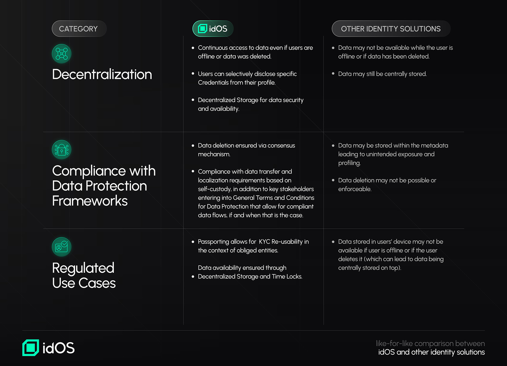

# idOS Regulatory approach

The development of web3 and decentralized technologies has brought about significant advancements in how we interact with digital assets and identities. While much of the focus has been on the self-custody of funds, the self-custody of data has yet to receive the same level of attention. For web3 to tap into real-world use cases, addressing this gap is essential. However, decentralized identity, especially from a legal perspective, presents various challenges that need to be addressed to unlock its full potential.

Decentralized, self-custodial identity data sharing and reusability allow individuals to have complete control over their identity data. It offers convenience as users can reuse verified identity information across multiple platforms and jurisdictions while usually presenting better security and privacy since decentralized approaches minimize reliance on centralized systems prone to breaches. It can also be cost-efficient as businesses can build leaner, safer infrastructure that focuses on interoperability and user-centricity.

#### The Regulatory Landscape: Complex but Essential

From a legal standpoint, decentralized, self-custodial identity reusability introduces unique challenges, particularly around compliance with global regulations. Some of the key issues include:

1. **Interoperability Across Jurisdictions:** Decentralized identity systems operate across multiple jurisdictions, and each has its own set of laws. Ensuring compliance with these varying regulations is complex and requires careful navigation to harmonize legal frameworks for global adoption.
2. **User-Centric and Data Protection Principles:** Aligning decentralized solutions with user-centric and other data protection and privacy principles outlined in regulations like the General Data Protection Regulation (“GDPR”) and the California Consumer Privacy Act (”CCPA”).
3. **Data Subject Rights:** Balancing individuals' rights, such as the "right to be forgotten" present in many data protection frameworks around the world, with obligations like retention requirements for Anti-Money Laundering (”AML”) purposes.
4. **Data Transfer and Localization Requirements:** Ensuring compliance with laws like the GDPR on data transfers while managing cross-border data flows.
5. **Availability Guarantees:** Providing robust assurances of data availability at any time for both regulatory and operational needs (even when users are offline).&#x20;
6. **Security and Technical Challenges:** While decentralized systems can enhance security, they might also present technical challenges that may have legal implications. Ensuring robust security measures are in place is essential for compliance and maintaining user trust.

These complexities may create barriers to innovation but also present opportunities for transformative solutions.

#### Decentralized Identity Solutions and idOS

As decentralized identity solutions gain traction, ensuring compliance and usability in highly regulated financial environments can still be considered a critical challenge. idOS has been designed with compliance at its core, aiming to be used for such highly regulated financial use cases.

In the evolving landscape of decentralized identity solutions, various approaches have emerged, each addressing in its own way the challenges above. Prominent among these are Identity wallets, ZK attestations (i.e. ZKPs), and Soulbound tokens (SBTs). While each offers unique contributions to the decentralized identity space, they may also present certain limitations, particularly concerning regulatory compliance and data availability. idOS effectively navigates these challenges, offering a compliant and user-centric solution.

**Identity wallets** empower users to store and manage their data locally, granting them control over information sharing. However,  if a user is offline or deletes their data, data consumers may not be able to access the necessary information, potentially disrupting services that rely on continuous data availability, on top of requiring the user to download one more plug-in. **ZK attestations** allow users to prove the validity of specific information without revealing the underlying data, enhancing privacy, but integration may be complex. **SBTs** can serve as digital proof of identity but may not allow users to selectively disclose parts of their stored information while keeping the underlying data on file and often data is stored within the metadata of the SBT which is linked to a single wallet in a single chain and can also result in unintended exposure and profiling.

idOS addresses these challenges by offering a decentralized identity solution that is reusable while aligning with regulatory requirements and ensuring data availability and user control:

* **User-Centric Control:** Users can view, add, share, and revoke access to their credentials, aligning with data protection principles that emphasize individual control over personal data.
* **Progressive Decentralization:** Once users give access to their data, idOS ensures that Data Consumers have access to user data even if users are offline or have deleted their local copies. This is achieved through the network of distributed nodes, providing users flexibility and reducing platform risks for data consumers.&#x20;
* **Selective Disclosure:** idOS allows users to selectively disclose specific credentials from their profile. In the near future, idOS aims to also allow users to only share access to parts of their stored data within a credential.&#x20;
* **Regulatory Compliance:** idOS is designed to allow for compliance with Anti-Money Laundering (AML) frameworks. Through its Passporting feature, for example, AML-obliged entities can leverage credentials previously issued by other obliged entities without the need for redundant verification processes.
* **Data Availability and Retention:** idOS guarantees data availability by storing users' self-encrypted data across multiple distributed nodes. Even if a node were to be offline, other active nodes will keep the network running. If a user deletes their data (or is offline), [time locks](/broken/pages/bZgdunkYCZkU5W8i8dI1) ensure that data remains accessible for the required retention periods previously agreed, facilitating compliance with regulations such as Anti Money Laundering laws.&#x20;
* **Data Protection Compliance:** idOS addresses main topics such as data transfer and localization requirements as it is always the user's choice to store information within idOS but also with general terms and conditions for data protection for key stakeholders which include safeguards that allow for compliant data flows. It also provides mechanisms for data deletion, enabling compliance with regulations that mandate the right to be forgotten.

See a like-for-like comparison between idOS and other identity solutions below:

<figure><figcaption></figcaption></figure>

While various decentralized identity solutions offer valuable features, idOS combines user-centric control, data availability, and robust regulatory compliance. Its design ensures that data owners, data issuers, and data consumers can operate within a secure, flexible, and compliant framework, addressing the limitations observed in other approaches.&#x20;
