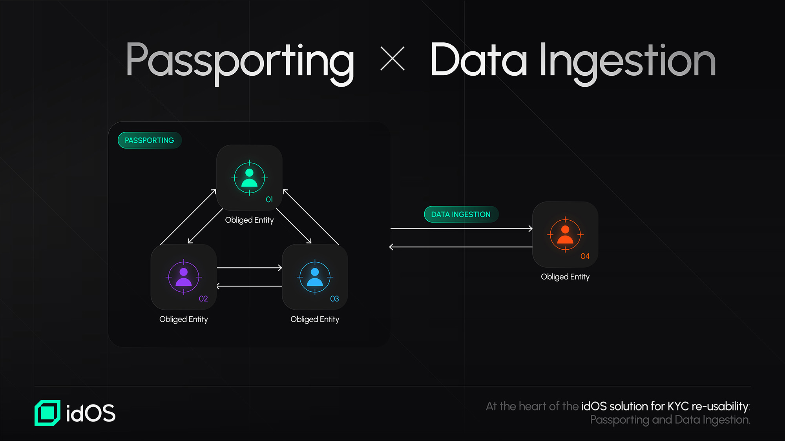

# KYC Re-usability

As covered under the [Market focus ](../../market-focus.md)section, KYC re-usability is a key focus of idOS today and aims to solve one of the most significant pain points for both users and businesses: the need for repetitive and costly identity verification processes. Such an approach aligns well with idOS’ mission: by enabling users to reuse credentials across a diverse ecosystem of applications and services, idOS aims to offer a seamless User Experience while allowing for adherence to stringent regulatory requirements.

At the heart of the idOS’ solution for KYC re-usability, there are two distinct but complementary mechanisms: **Passporting** and **Data Ingestion**.

<figure><figcaption></figcaption></figure>

#### **Passporting: A Primary Solution for KYC Re-usability**

[Passporting](passporting.md) is the gold standard for KYC re-usability within idOS. In this model, an AML-obliged entity can rely on the Customer Due Diligence (CDD) measures already performed by another obliged entity.

Obliged entities are usually financial institutions that are subject to Anti-Money Laundering (AML) regimes. Those are prohibited from keeping anonymous accounts and are required to undertake Customer Due Diligence measures before the establishment of a business relationship with the customer.

Those usually include, depending on the regulatory framework, and among others: credit institutions, financial institutions, providers of exchange services between virtual and fiat currencies, and custodian wallet providers.

In a Passporting scenario, there are two key entities involved:

* The **obliged entity relied upon**, which has already conducted the KYC process for the user and has issued a Credential to the user within idOS.
* The **relying obliged entity**, who leverages the Credentials issued by the obliged entity relied upon.

The relying obliged entity does not need to recollect and reverify all the KYC information again as long as the applicable legal and regulatory requirements for Passporting are fulfilled. This results in faster onboarding, lower costs, and a better overall user experience.

#### **Data Ingestion: An Alternative Path for KYC Re-usability**

In cases where Passporting is not feasible — perhaps due to jurisdiction-specific constraints — idOS offers an alternative method: [Data Ingestion](data-ingestion.md).

The user can share a KYC data package, encapsulated within a credential, directly with a Data Consumer.

Unlike Passporting, the Data Consumer of such credential may still need to verify the corresponding data package before making a decision to onboard the user (including, for example, performing an additional liveness check). While this involves some additional effort when compared to Passporting, it eliminates the need for users to resubmit their information repeatedly and it still offers significant time and cost savings compared to traditional KYC processes. This process is facilitated by the [idOS SDK](/broken/pages/hpS8ofIxIwM3fj8nNdtF).

By offering both Passporting and Data Ingestion as options for KYC re-usability, idOS provides flexibility for various regulatory and operational contexts. Whether through seamless Credential sharing or direct data ingestion, idOS empowers users and entities to unlock the full potential of decentralized identity while fostering compliance and scalability.
