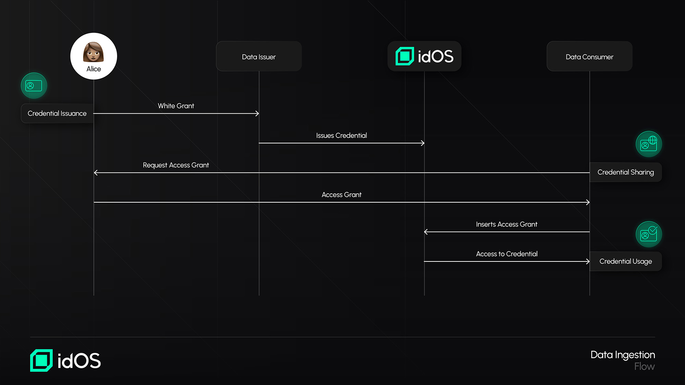

# Data ingestion

#### What is Ingestion and Who is Involved?

Ingestion is one of the KYC Re-usability options within idOS and an alternative mechanism to Passporting that allows data consumers to have access to a KYC data package within a credential, coming directly from the user upon an Access Grant, and verify it before making a decision to onboard the user.&#x20;

Unlike Passporting, which requires both parties to be obliged entities (entities subject to AML/CFT obligations such as those required to apply Customer Due Diligence measures), Ingestion does not have such a restriction. Any entity—regulated or unregulated—can leverage Ingestion to streamline user onboarding.

Ingestion offers a significant advantage by allowing users to provide their KYC data package to data consumers without resubmitting all required information. While re-authentication measures such as another liveness check at the time of onboarding may still be necessary, the elimination of redundant data submissions reduces onboarding friction and prevents user drop-off.

This solution is particularly suited for teams that conduct customer verification in-house or use third-party KYC service providers that accept ingested KYC data.&#x20;

**Ingestion in Action**

* **Credential Issuance**: The user already has a credential issued within idOS.&#x20;
* **Credential Sharing**: The user creates an encrypted copy of the credential for the Data Consumer (e.g. because the user wants to onboard to such data consumer's services) and shares an Access Grant with the Data Consumer. Since this data consumer wants to benefit from Ingestion, it inserts the Access Grant directly into idOS.&#x20;
* **Credential Usage**: The Data Consumer has now access to the credential and its content and may verify the underlying data, including for example another liveness check at the time of onboarding.&#x20;
* **Collection of Additional Data**: The Data Consumer (or its identity verification provider) can now request the user to share additional information, as well as issue those as credentials to the user's idOS profile (with the user's agreement once a Write Grant is given).&#x20;

<figure><figcaption></figcaption></figure>

While Ingestion is not the primary solution for KYC Re-usability within idOS for regulated entities, it remains a powerful option. It allows for a seamless user experience by eliminating redundant data submissions while still enabling entities to meet their onboarding compliance requirements. The flexibility to verify the content of the credential in-house or via third-party providers ensures that Ingestion remains an effective tool for a broad range of organizations.

If you would like to know more about Ingestion, please reach out to legal@idos.network.&#x20;
