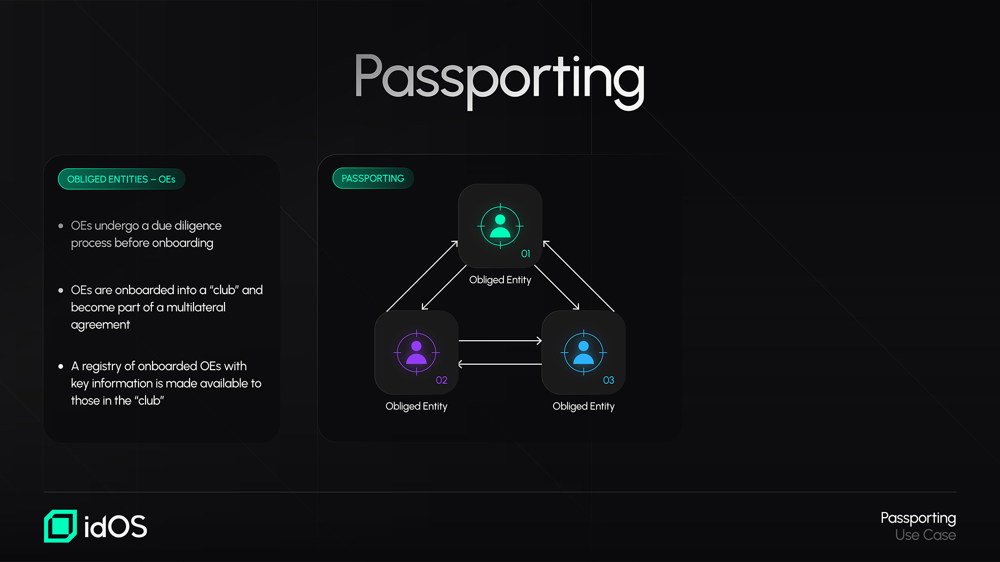
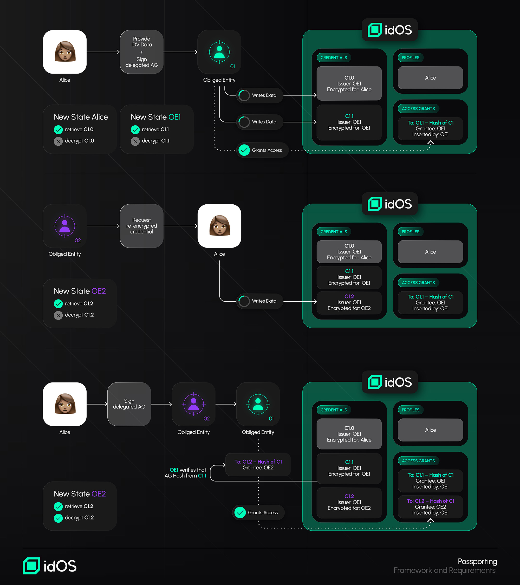
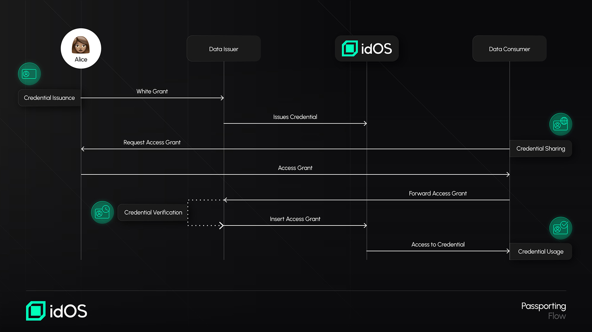

# Passporting

**What is Passporting, and Who is Involved?**

Passporting is not a concept created by idOS, it is grounded in international standards and national regulations: the Financial Action Task Force ("FATF") for example, in its [Recommendation 17](https://www.fatf-gafi.org/content/dam/fatf-gafi/recommendations/FATF%20Recommendations%202012.pdf.coredownload.inline.pdf), allows obliged entities ("OEs") - financial institutions that are subject to AML regimes and are required to conduct Customer Due Diligence to establish a business relationship with their customers - to rely on third parties to introduce a business or to perform the identification and verification of a customer identity. This process is also referred to as "reliance on third parties" or "delegation of due diligence measures to third parties" in international and national regulatory frameworks. idOS simply streamlines such processes for KYC-related data re-sharing between entities.&#x20;

Similarly to FATF, in the EU framework, as per Article 25 _et seq._ of the [5th AML Directive](https://eur-lex.europa.eu/legal-content/EN/TXT/?uri=CELEX%3A02015L0849-20240709), **national regimes may permit obliged entities to rely on third parties** to meet generally the same Customer Due Diligence measures that FATF allows, with the ultimate **responsibility for meeting those requirements** also remaining **with the obliged entity** which relies on the third party. Certain conditions must also be met for the reliance to be admissible, very similar to what FATF prescribes. The recent [EU AML Regulation](https://eur-lex.europa.eu/eli/reg/2024/1624/oj/eng) also enhances harmonization and adds requirements for such mechanism under its Section 6, and by 2027, the [AMLA](https://www.amla.europa.eu/about-amla_en) guidelines will further detail Passporting conditions.&#x20;

As introduced under the KYC Re-usability section, for Passporting within idOS to take place there are at least two obliged entities involved and only entities subject to AML and Combating the Financing of Terrorism ("CFT") obligations, such as conducting Customer Due Diligence measures (i.e. obliged entities) are eligible for Passporting within idOS. Users facilitate the process by giving [Access Grants](/broken/pages/bZgdunkYCZkU5W8i8dI1) for their encrypted credentials.&#x20;

**Passporting Framework and Requirements**&#x20;

In general, idOS aims to provide a framework that aligns with the most common and similar legal requirements for the Passporting of credentials between obliged entities found under national regimes and international standards: it allows for customer data in the context of Customer Due Diligence measures to be immediately shared between obliged entities who can ascertain if the obliged entity being relied on is subject to equivalent Customer Due Diligence measures, retention and supervision/monitoring requirements, through an evaluation process that takes place before obliged entities’ onboarding to idOS, as well as if the obliged entity being relied on is not established in a high-risk jurisdiction.

It also offers a programmatic solution that allows for arrangements between the obliged entities to be entered into while ongoing monitoring (and enhanced due diligence whenever needed) can always be performed by the obliged entity that consumed the passported credentials through an independent process.

Below is an overview of the most common and similar requirements for Passporting found under national regimes and international standards and how idOS tackles them.&#x20;

| Requirements for Passporting                                                                                                                                                                                             | idOS approach details                                                                                                                                                                                                                                                                                                                                                                                                                                                                                                                                                                                                                                                                                                                                                                 |
| ------------------------------------------------------------------------------------------------------------------------------------------------------------------------------------------------------------------------ | ------------------------------------------------------------------------------------------------------------------------------------------------------------------------------------------------------------------------------------------------------------------------------------------------------------------------------------------------------------------------------------------------------------------------------------------------------------------------------------------------------------------------------------------------------------------------------------------------------------------------------------------------------------------------------------------------------------------------------------------------------------------------------------- |
| Passporting is possible for the identification and verification of a customer’s identity.                                                                                                                                | Obliged entities issue encrypted customers’ Credentials containing the KYC information into the idOS network that can be consumed by another obliged entity.                                                                                                                                                                                                                                                                                                                                                                                                                                                                                                                                                                                                                          |
| Passporting is usually possible only between obliged entities that apply equivalent (or higher) levels of Customer Due Diligence and retention obligations and are under equivalent supervision/monitoring.              | 
Obliged entities undergo a process before onboarding to the idOS that includes an evaluation that verifies their subjection and alignment with Customer Due Diligence measures, record-keeping, and supervision/monitoring.  It is fair to assume that the AML systems that apply to obliged entities in the European Economic Area Member States have equivalent requirements, facilitating the reliance between obliged entities established in those Member States.   Obliged entities can always freely choose from which obliged entities they are comfortable Passporting credentials.  Obliged entities can also set the properties that the credentials need to fulfill (e.g. proof of address must have been issued within the last three months). 
 |
| Passporting from obliged entities established in high-risk jurisdictions is usually not allowed.                                                                                                                         | Obliged entities know the country of establishment of an obliged entity they intend to rely on, before Passporting, based on a registry that is available to all onboarded obliged entities and that contains key information about them, including their jurisdiction.                                                                                                                                                                                                                                                                                                                                                                                                                                                                                                               |
| The relying obliged entity must get from the obliged entity relied upon the necessary information concerning the Customer Due Diligence, including copies of identification and verification data, usually immediately.  | 
The transmission of data happens between obliged entities and such transmission is immediate and of the full data set within a credential (e.g. including a copy of the identity document).  The relying obliged entity has immediate access to the outcomes of the Customer Due Diligence performed.  The exchange of additional information is possible through the contact information available on the registry of onboarded obliged entities. 
                                                                                                                                                                                                                                                                                                                |
| A certain form of arrangement between the obliged entities (e.g. a written agreement) or documentation on the reliance may be required.                                                                                  | 
Obliged entities' onboarding become part of a multilateral agreement. The content of this agreement includes requirements from most relevant jurisdictions as well as general terms and conditions for data protection to allow for compliant data flows.

 Obliged entities may also independently enter into specific arrangements in addition to such multilateral agreement, if so required from a legal or operational perspective. 
                                                                                                                                                                                                                                                                                                                              |
| Chain of reliance may not be permitted.                                                                                                                                                                                  | 
Obliged entities can always freely choose from which obliged entities they are comfortable Passporting credentials.   Additionally, a chain of reliance does not work in idOS: the relying obliged entity will not become itself an obliged entity relied upon for the credential it consumed. Passporting is always started by the user, who can only start a new Passporting flow for the credential issued by the original obliged entity relied upon.
                                                                                                                                                                                                                                                                                                                |

National frameworks may impose specific requirements for Passporting, many of which the idOS solution for Passporting takes into account and is able to fulfill or help solve. For example, the need for a risk assessment on the obliged entity relied upon found under certain regimes (e.g. Latvia), or the requirement imposed by the Singaporean regime where the obliged entity relied upon cannot be one that is precluded from reliance by the competent supervisory authority, could be complied with based on the information included in the registry of obliged entities available to obliged entities successfully onboarded into idOS.&#x20;

**How Does Passporting Work with idOS?**

**Phase** **1: Obliged Entity Onboarding**

<figure><figcaption></figcaption></figure>

* Obliged entities that wish to benefit from Passpoting within idOS become members of a permissioned “club,” provided they successfully complete the onboarding process. Such onboarding process includes becoming part of a multilateral agreement and undergoing a due diligence process, including checks for subjection and alignment with Customer Due Diligence measures, retention, and supervision/monitoring.&#x20;
* The obliged entities successfully onboarded are provided with a registry, which includes key information about the obliged entities who are part of this "club" (e.g. jurisdiction, contact, etc.).

**Phase 2: Passporting in Action**

<figure><figcaption></figcaption></figure>

* **Credential Issuance**: The obliged entity being relied upon issues a credential to a user within idOS after the user has gone through KYC in the context of the obliged entity relied upon (with the user's agreement upon a Write Grant). It is relevant to highlight that any Access Grant contains a Hash or Signature to the clear-text content of the Credential and that Credentials may be revoked by its issuer.&#x20;
* **Credential Sharing**: The user creates an encrypted copy of the credential for the relying obliged entity (e.g. because it wants to onboard to such entity's services) and shares an Access Grant with the relying obliged entity. Since this relying obliged entity wants to benefit from Passporting, it does not insert the Access Grant directly into idOS but forwards it to the obliged entity relied upon, much like a request from an entity to the other.&#x20;
* **Credential Verification**: Before inserting the Access Grant into idOS, the obliged entity relied upon verifies that the Hash/Signature in such Access Grant matches the version of its own credential, and only then it inserts the Access Grant into idOS.&#x20;
* **Credential Usage**: The relying obliged entity now has access to the credential and confirmation that its version matches the obliged entity relied upon's version. The relying obliged entity may also independently perform additional checks if so required (e.g. additional PEP/Sanctions screening).&#x20;

<figure><figcaption></figcaption></figure>

The idOS Passporting solution has been assessed against various regulatory frameworks across multiple jurisdictions.

For more technical details, please see [https://github.com/idos-network/idos-sdk-js/blob/main/docs/passporting.md](https://github.com/idos-network/idos-sdk-js/blob/main/docs/passporting.md)

To learn more, please contact our legal team at legal@idos.network.&#x20;
