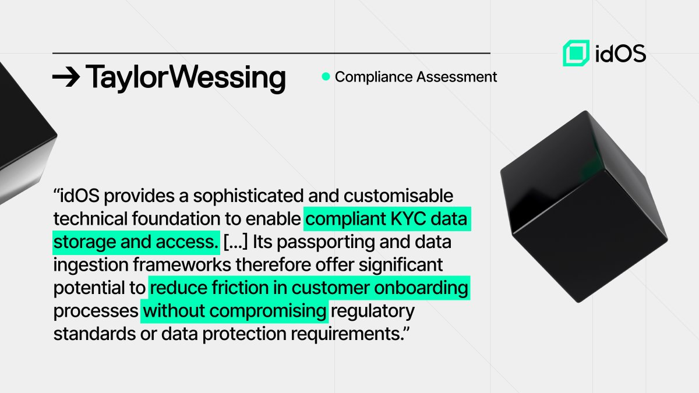

# Legal Assessment

To help validate the compliance and regulatory suitability of the idOS infrastructure, [**Taylor Wessing**](https://www.taylorwessing.com/), a leading international law firm, conducted an independent legal assessment of our system.

<figure><figcaption></figcaption></figure>

The review was conducted mainly from the perspective of obliged entities looking to integrate idOS, including for KYC/AML purposes. It focused on evaluating whether the platform effectively meets the legal and corresponding operational requirements that such entities must follow under the UK framework, considering also the aligment with EU and international regulatory standards.

Key areas of the assessment included:

* KYC data storage
* KYC Re-usability (including [Passporting](kyc-re-usability/passporting.md) and [Data Ingestion](kyc-re-usability/data-ingestion.md))
* Data protection frameworks

We view this as another step forward in helping demonstrate that idOS (and its KYC Re-usability frameworks) is a sophisticated and customisable integration option for regulated entities seeking to streamline their identity workflows and reduce friction in their user onboarding processes while staying in compliance with regulatory standards.

We remain focused on building infrastructure that enables secure, compliant, decentralized and reusable digital identity, by design.
