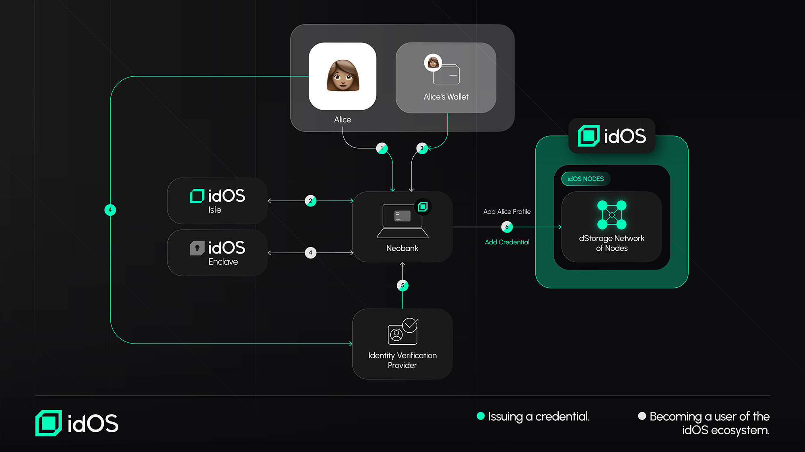
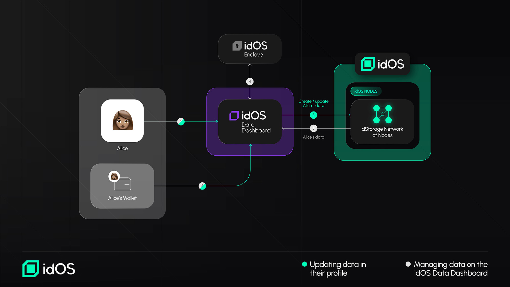
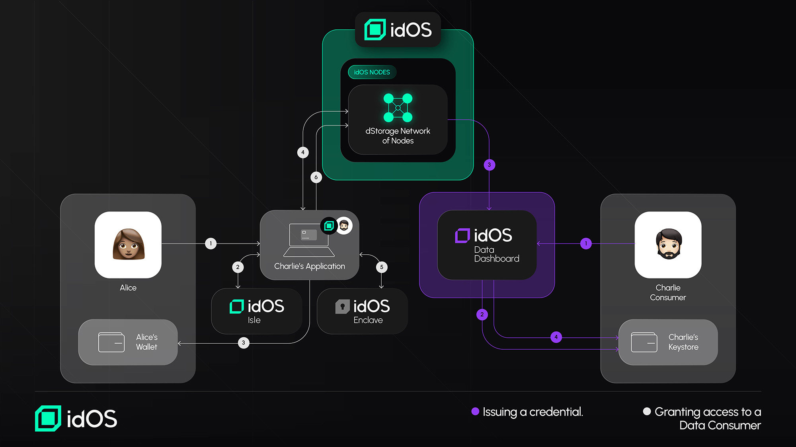

# Data flows

idOS provides multiple ways for users to access, manage, and share their identity data securely. Below, we outline four key user flows, demonstrating how users interact with the idOS network at different stages.

### A new user joins idOS and gets a credential issued into their profile 

**(A): Joining the idOS ecosystem:** A new user (in this case Alice) joins idOS by (1) going to any integrated idOS Issuer or Consumer Application. If the integrating dApp uses the idOS Isle Alice will interface accordingly (2). Alice verifies her wallet (3). (4). Alice defines a secure encryption key seed via the idOS enclave. (5) The idOS Data Issuer ("Neobank") creates Alice’s idOS entry and adds her wallet to her data store. \
&#xNAN;**(B): Issuing a new Credential:** Alice gets her first credential by (1) interfacing with the integrating application (1), interacting with idOS Dashboard (if integrated, 2), the supporting app ("Neobank) will ask Alice for a (delegated) Write Grant (3). and takes her through an (externally integrated) Verification flow (4). After successful verification, the Service will return verified information (5) and write it signed into the idOS (6).

<figure><figcaption>
Onboarding and Credential Issuance.
</figcaption></figure>

### **A user manages data on a data dashboard** 

**(A): Accessing Data in the idOS Profile:** For Alice to see her data on a dashboard (e.g. the [User Data Dashboard](https://app.gitbook.com/o/CTEccIGTIOCKYOoZR03F/s/HHuxcxHW3wWO2HhMI3B3/how-it-works/functionality/user-data-dashboard)), she needs to (1) go to a data dashboard and (2) sign a message transaction with her wallet for the dashboard (3) to retrieve her idOS data. Afterwards she needs to decrypt the end-2-end encrypted data via an implemented idOS Enclave interface (4).\
(**B): Updating Data in the idOS Profile**: To change data on the dashboard, Alice (1) signs a message through her wallet (2) the dashboard then creates or updates her idOS data according to her input and (3) reloads Alice’s data from the idOS.

<figure><figcaption>
Reading and Writing Data through the Dashboard
</figcaption></figure>

### **Granting another user access to data** 

**(A) Granting access to a Data Consumer:** Alice grants Bob access to her data by (1) going to a integrated idOS Issuer or Consumer Application, optionally interacting with the idOS Isle (2), creating an access grant and (3) approving the transaction in her wallet. The Access Management Protocol is (4) updated, which in directly updates the idOS nodes. The encrypted credential is retrieved from the idOS, decrypted via the idOS enclave (5), reencrypted for the recipient (Charlie) and placed back into the idOS (6). Charlie can now see Alice’s data on a dashboard, and/or get it from a node. (see next flow)\
(**B) Retrieving Credential via the idOS Data Dashboard:** Charlie can now (1) go to his data dashboard, (2) sign a message in his wallet and (3) see Alice's data that the dashboard dApp retrieved from the idOS (unless Alice revokes the grant or deletes the data before). The retrieved data needs to be decrypted (4).

<figure><figcaption>
Granting Access to a Data Consumer
</figcaption></figure>

