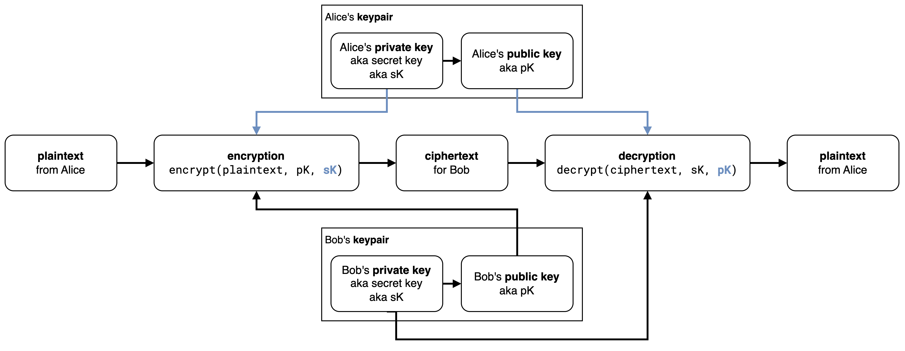
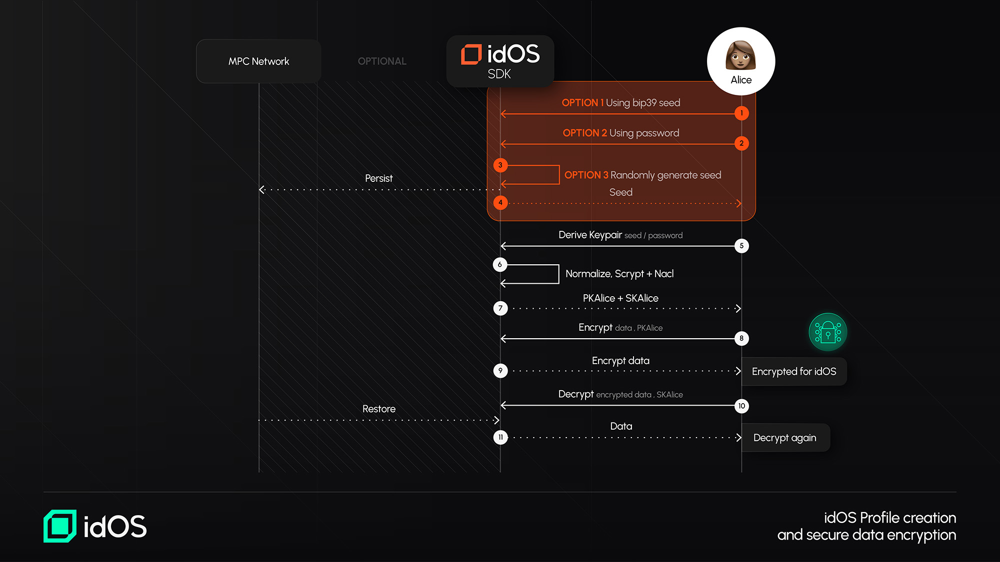
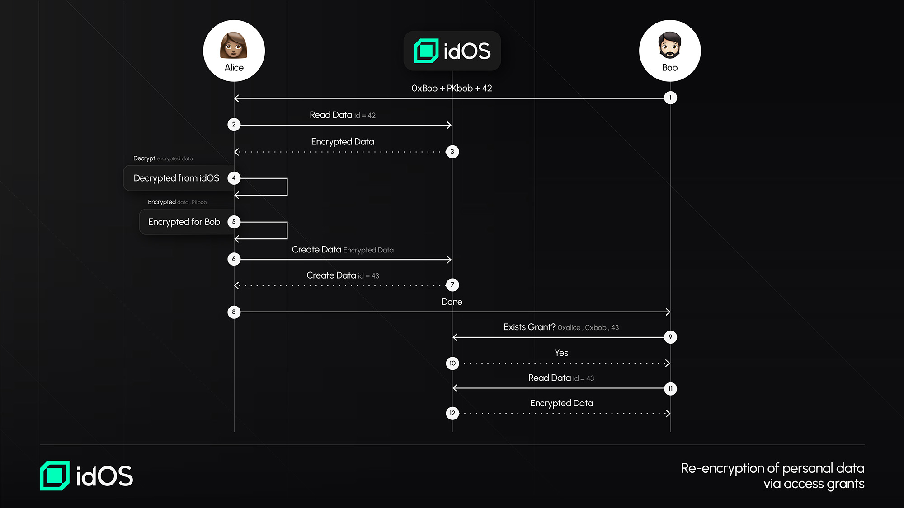

# Encryption flows

## Overview of Encryption in idOS

idOS employs asymmetric encryption as a default method to secure user data, ensuring that only authorized parties can access sensitive information. Every user profile in idOS is linked to a public-private key pair, which is used to encrypt and decrypt data. By default, when data is added to idOS, it is encrypted using the user’s public key, meaning that only the user (or explicitly authorized recipients) can decrypt it using their private key.

Following modern cryptographic standards, idOS adopts NaCl/libsodium (Curve25519 + ChaPoly AEAD) encryption, a well-established approach recommended by security experts such as Latacora. This ensures strong confidentiality and integrity protections for all stored user data.

While encryption is the default and strongly recommended, idOS also allows for unencrypted data to be added if a user chooses to do so. However, this is highly discouraged, as it exposes data to potential unauthorized access.

## When Does Data Encryption Occur?

Data encryption occurs at multiple stages in idOS:

1. When identity verification providers issue Verifiable Credentials – Trusted verification providers encrypt credentials before writing them into the idOS.
2. When users add data manually – Users who enter data through the idOS Dashboard will have their data encrypted automatically by default.
3. When data access is granted to a third party – If a user grants access to an entity (such as an app or institution), the data is decrypted by the user, re-encrypted with the recipient’s public key, and re-uploaded to the idOS network.

The idOS provides open-source SDKs that enable third parties to securely encrypt data following these same standards, ensuring that default encryption is built into all components interacting with the idOS.

## Encryption in idOS

The idOS uses **authenticated asymmetric encryption**. Encryption being **asymmetric** means that Alice can encrypt a message for Bob (and vice versa) without them having to previously agree on a shared encryption key. It being **authenticated** guarantees message authenticity and integrity, each property respectively assuring Bob that the message was indeed encrypted by Alice and wasn’t tampered with.

<figure><figcaption></figcaption></figure>

To do this, we employ `x25519-xsalsa20-poly1305`: a modern and proven [ECIES Hybrid Encryption Scheme](https://cryptobook.nakov.com/asymmetric-key-ciphers/ecies-public-key-encryption). The idOS Enclave includes [tweetnacl](https://github.com/dchest/tweetnacl-js), a famous implementation of this scheme. Let’s break it down and see what it means.

Say Alice wants to encrypt a message for Bob. To do this, she needs 3 things: the **message**, her **private** key, and Bob’s **public** key.

1. First, we use these **private** and **public** keys, together with a nonce, to compute a unique shared secret. It does this using the `x25519` [ECDH](https://cryptobook.nakov.com/asymmetric-key-ciphers/ecdh-key-exchange) function, a key agreement algorithm based on the `Curve25519` elliptic curve.
2. We then use this shared secret to encrypt the **message** with the `xsalsa20` symmetric stream cipher. This is an algorithm used to symmetrically encrypt data of arbitrary size.
3. Finally, we calculate a message authentication code (a [MAC](https://en.wikipedia.org/wiki/Message_authentication_code)) using the `poly1305` algorithm. This MAC is sent along with the encrypted message and can be used to verify that it wasn’t tampered with.

To decrypt and authenticate the resulting ciphertext, Bob does a mirror version of this process to obtain the original **message**.

### Ephemeral keys

Note that from an access control perspective, in the context of Access Grants, data in idOS is not actually shared. That is, an encrypted credential in idOS is never accessible for two distinct partners (e.g. Issuer and Owner) — instead, an encrypted copy of the "shared" data is created for each Access Grant.

The encryption scheme described above makes it possible for the sender — not just the receiver — of an encrypted message to also decrypt it. While informationally speaking this doesn't affect security (since the sender had, by definition, access to the encrypted message), we chose to be stricter here: our SDKs always encrypt data using an ephemeral private key.

This ensures that, if an Issuer leaks its private encryption key, the credentials they encrypted for users can't be decrypted with that key even if accessed.

## Derived Key Generation

The idOS supports key derivation from user passwords, providing a familiar, non-technical approach to encryption while ensuring security. When users set up their idOS profile, they can derive encryption keys through a key derivation function (KDF).

The process follows these steps:

1. The user selects a source of entropy for a seed.
2. Scrypt-js is used to derive a 32-byte encryption key from the seed.
3. The seed is also used with TweetNaCl-js to generate an asymmetric key pair (x25519-xsalsa20-poly1305).

To maintain determinism while preventing rainbow table attacks, scrypt parameters are kept constant for all users. However, to strengthen security, each user’s idOS ID is used as a unique salt by default. Future upgrades will introduce bip39 mnemonic seed phrases for users, providing an even stronger and more flexible encryption model.

## Encryption Flows in idOS

Encryption in idOS follows well-defined processes to ensure consistent and secure handling of user data. Below are two core encryption flows:

### Encryption Flow #1: Using Derived Keys (From Seed or Password)

1. A user-generated password is converted into a cryptographic key using a key derivation function (scrypt).
2. The derived key is used to generate an asymmetric key pair for encryption.
3. Any new data added by the user is encrypted with their public key before being stored in the idOS.

This approach ensures that even if an attacker gains access to the raw data stored in the idOS, it remains unreadable without the user’s decryption key.

<figure><figcaption>
Profile Creation and Encryption within idOS
</figcaption></figure>

### Encryption Flow #2: Encrypting Data for Third-Party Access

1. A user decrypts their own data using their private key.
2. The data is re-encrypted using the recipient’s public key (e.g., a dApp, institution, or verifier).
3. The newly encrypted data is uploaded to the idOS, ensuring that only the intended recipient can access it.

This model prevents unnecessary data duplication while keeping access control entirely in the hands of the user.

<figure><figcaption></figcaption></figure>

## The Role of the idOS Enclave in Encryption

The idOS Enclave is designed to further enhance security and privacy for encrypted user data. While the encryption model already ensures that data cannot be accessed without the correct private key, the enclave will introduce hardware-based security guarantees to protect key management and access control logic.

The enclave is being designed to function as a trusted execution environment (TEE) that securely processes encryption, decryption, and key exchange operations. By leveraging secure enclaves, the idOS can introduce additional protections, such as:

* Shielding encryption keys from potential attacks at the software or operating system level.
* Ensuring secure execution of cryptographic operations, reducing exposure to external threats.
* Enhancing compliance with privacy regulations by adding an additional layer of controlled access.

While the idOS encryption system is already robust, the enclave further strengthens security guarantees for high-value and high-risk identity-related data.

For more information see [https://github.com/idos-network/idos-sdk-js/blob/main/docs/enclave.md](https://github.com/idos-network/idos-sdk-js/blob/main/docs/enclave.md)

## Encryption key storage via MPC&#x20;

To improve UX and make the handling of idOS encryption keys simpler and more ergonomic, we have partnered with Partisia to add an MPC-TSS based capability for storing and retrieving idOS encryption keys with a simple wallet signature. Details on this can be found [here](../mpc-for-encryption-keys.md).&#x20;

