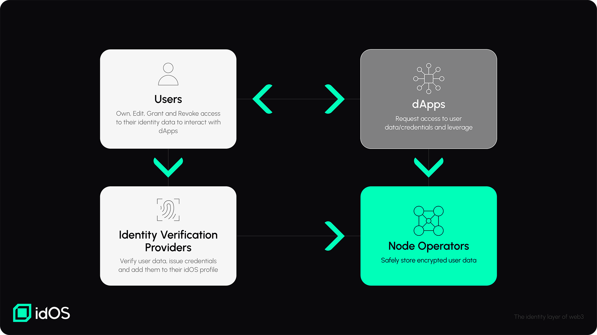

# Roles (main stakeholders)

<figure><figcaption></figcaption></figure>

## Users

Users are the central stakeholder in the idOS. Users can view their own data in the [User Data Dashboard](../functionality/user-data-dashboard.md). They can also add, share, review and revoke access to their data. Users [encrypt](../encryption.md) their data with their own self-generated public/private keypair. Users can ask data providers for [Verifiable Credentials](decentralized-storage/w3c-verifiable-credentials.md) to be added to their idOS account. Users can also chose to delete their data. Users can add one or multiple addresses to control their idOS account across multiple blockchain ecosystems.&#x20;

## Node operators

[Node providers](../functionality/compliant-dstorage.md) host [user data](../../overview/what-data-how-is-it-stored.md) and execute the idOS dStorage Network of Nodes that governs access and administration rights. Node operators provide an endpoint that allows all stakeholders to communicate with the idOS. They enforce access rights and block unauthorized access. Node providers sync encrypted data among the dStorage Network of Nodes and enforce the state consensus. Node providers are the main role to become [progressively decentralized](../progressive-decentralization.md).

## dApps (and other third parties)

dApps can [request data](../functionality/granting-data-access.md) access from users using the [SDK](../../developer-docs/dapp-sdk-integration.md) by asking the user for a signature and querying an idOS node. This data can be sent to the dApp’s backend, for example when it needs to be [decrypted](broken-reference) and/or privately stored. They can access data even if the user is offline with the precondition that the access grant is still active. dApps can verify that data provided by the user has been issued by a trusted data provider. dApps can send users that are new to the idOS to a data provider onboarding journey. They may also leverage other tools built on and for the idOS, like the [User Data Dashboard](../functionality/user-data-dashboard.md) to allow users to view their data.

Users can also be asked for data access grants. In this scenario, the dApp would ask the user for a transaction into the idOS whitelist contract. After this step, the dApp can use its backend to get idOS data directly.

## Identity verification providers

Identity verification providers help users to add data that has been verified and dApps to trust data input. They usually support onboarding journeys that can be used by dApps to onboard users to the idOS. They supply verified data in the [W3C Verifiable Credential](decentralized-storage/w3c-verifiable-credentials.md) standard to allow for easy consumption of the data by dApps. Identity verification providers are the trust layer that confirms claims that users are making about them. \
