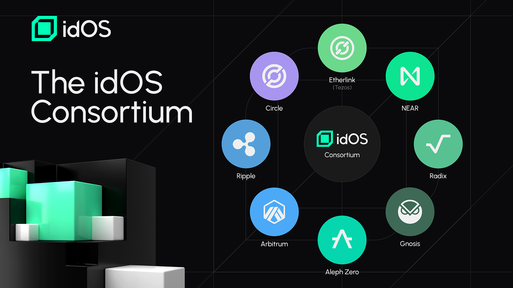

# The idOS Consortium

**Building a web3-wide decentralized identity is too big of a challenge for one party to succeed alone**. idOS is a collaborative effort across leading ecosystems in web3 to build the right identity solution for actual user adoption.

Reach out, if you are an ecosystem interested in joining the idOS!

<figure><figcaption></figcaption></figure>

## idOS Consortium Partners&#x20;

### Arbitrum

[Arbitrum](https://arbitrum.io/) is the a leading Layer 2 ecosystem for scaling and empowering Ethereum with more than +600k weekly active addresses, 15bn TVL and +800 projects deployed and a strong focus on DeFi.

### Circle

[Circle](https://www.circle.com/en/) is a financial technology company that offers USDC, a fully reserved and regulated US dollar stablecoin, which provides secure and transparent digital transactions. They also provide a suite of Web3 services, including programmable wallets and a smart contract platform, enabling developers to integrate blockchain technology into their applications seamlessly​

### Ripple

[Ripple](https://ripple.com/) provides enterprise blockchain solutions for finance, using proven crypto and blockchain technology to enable faster, more transparent, and cost-effective financial services. Their solutions facilitate instant cross-border payments and digital asset custody, aiming to transform how value is moved, managed, and tokenized globally.

### NEAR

[NEAR](https://near.org/) is the chain abstraction stack, empowering builders to create apps that scale to billions of users and across all blockchains. The NEAR Blockchain Operating System (BOS) effortlessly allows to create and distribute innovative dApps across any blockchain, while helping build a more open web. Today, more than 750 projects are building on near, leveraging a community of more than 550k users.

### Gnosis

[Gnosis Chain](https://www.gnosis.io/) is one of the first Ethereum side chains. Secured by over 120k validators, Gnosis prioritizes credible neutrality and resiliency. Gnosis has also developed some of the most established tools and dApps in web3 for payments and real-word adoption like [Safe](https://safe.global/), [Monerium](https://monerium.com/) and [Gnosis Pay](https://gnosispay.com/). &#x20;

### Aleph Zero

[Aleph Zero](https://alephzero.org/) is a privacy-enhancing layer 1 public blockchain with instant finality, focused on transaction speed and scalability and hosting a community of  more than 100k users.

### Radix

[Radix](https://www.radixdlt.com/) aims to provide a radically improved user and developer experience in web3 for DeFi applications. It features the Radix Engine and Scrypto programming language, designed for secure and scalable development of DeFi applications. Radix offers tools like the Radix Wallet for user-friendly interactions with decentralized applications and focuses on making blockchain technology accessible and intuitive.

### Etherlink

[Etherlink](https://www.etherlink.com/), developed by the [Tezos](https://tezos.com/) Foundation, is a Layer 2 blockchain solution powered by Tezos Smart Rollups technology focused on DeFi adoption, offering near-zero transaction costs and enhanced scalability. It features decentralized governance, allowing stakers to propose and vote on upgrades, and built-in MEV protection through threshold encryption to prevent transaction tampering. Etherlink aims to provide a fast, fair, and cost-effective platform for developers and users in the web3 ecosystem.
